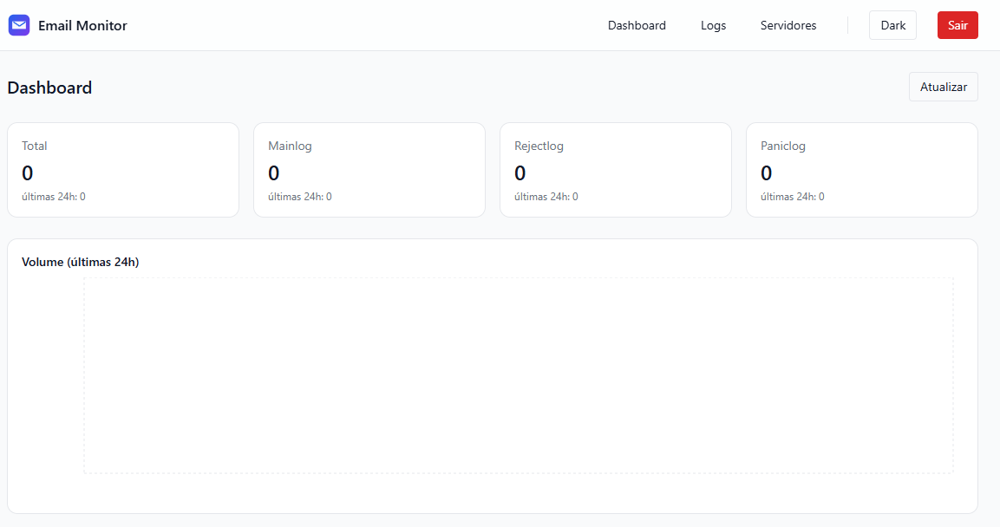
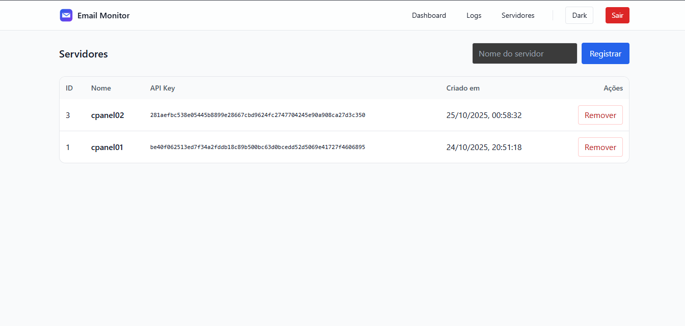

# Email Monitor

Aplicação para ingestão e visualização de logs de e-mail, com backend FastAPI, frontend React (Vite + Tailwind) e Postgres.

## Stack
- Backend: FastAPI + SQLAlchemy + SlowAPI (rate limit)
- Frontend: React + Vite + TailwindCSS + Recharts
- Banco: PostgreSQL
- Infra: Docker Compose + Nginx (SPA)

## Pré-requisitos
- Docker e Docker Compose

## Subir o projeto (modo rápido)
```bash
# na raiz do projeto
docker compose up -d --build
```
- Backend: http://localhost:8000 (docs em http://localhost:8000/docs)
- Frontend: http://localhost:5173
- Postgres: localhost:5432 (interno ao compose)

Observações:
- O `docker-compose.yml` já injeta `VITE_API_URL=http://localhost:8000` para o frontend.
- O Nginx do frontend serve a SPA e cuida de rotas client-side.

## Primeiro acesso: criar usuário admin
O backend expõe um endpoint de seed para criar um usuário admin padrão.

1) Executar o seed (uma vez):
```bash
curl -X POST http://localhost:8000/api/login/seed-admin
```
Resposta esperada:
- `{ "detail": "created" }` na primeira execução
- `{ "detail": "exists" }` se já existir

2) Credenciais padrão para login no frontend:
- E-mail: `admin@example.com`
- Senha: `admin123`

Recomendações:
- Altere a senha após o primeiro login (futuramente poderá haver endpoint/tela para isso).

## Uso básico
### 1. Login
Acesse http://localhost:5173, faça login com o admin. O token é salvo no navegador.

### 2. Cadastrar servidor
Pela UI, vá em "Servidores" e registre um nome. Alternativamente, via API:
```bash
# cria um servidor (GET com query por simplicidade)
curl "http://localhost:8000/api/servers/register?name=meu-servidor"
```
Anote o `api_key` retornado. Os logs enviados com esse `X-API-Key` serão atribuídos a este servidor.

### 3. Ingestão de logs
Endpoint de ingestão autenticado por chave:
```
POST /api/maillog
Headers: X-API-Key: <api_key_do_servidor>
Body (JSON): lista de objetos com {kind, timestamp, sender, recipient, status, message, message_id}
```
- `kind`: `mainlog` | `rejectlog` | `paniclog`
- `timestamp`: ISO8601

### 4. Agente coletor (opcional)
Há um agente de exemplo em `agent/agent.py` que lê arquivos de log e envia lotes ao backend.

Exemplo de config (`agent/config.sample.json`):
```json
{
  "server_name": "meu-servidor",
  "api_url": "http://localhost:8000/api/maillog",
  "api_key": "<cole a api_key do servidor>",
  "logs": {
    "mainlog": "/var/log/exim/mainlog",
    "rejectlog": "/var/log/exim/rejectlog",
    "paniclog": "/var/log/exim/paniclog"
  },
  "interval_seconds": 10,
  "state_file": "./agent_state.json"
}
```
Execução local (fora de containers):
```bash
python agent/agent.py
```

### 5. Visualização
- Dashboard: KPIs totais e das últimas 24h, com gráfico de volume.
- Logs: filtros (servidor, email, tipo, status), paginação, auto-refresh, modal de detalhes.

## Capturas de tela
Login e Dashboard:





## Rebuilds e desenvolvimento
- Rebuild do frontend ao alterar UI:
```bash
docker compose up -d --build frontend
```
- Rebuild do backend ao alterar API:
```bash
docker compose restart backend
```
- Logs do backend:
```bash
docker compose logs -f backend
```

## Problemas comuns
- Banco "unhealthy" ao subir: o Compose já aguarda; alguns segundos a mais e estabiliza.
- CORS no desenvolvimento: já liberado para `*` no backend.
- Frontend não enxerga backend quando via container: `VITE_API_URL` já definido como `http://localhost:8000` (acessível pelo navegador).

## Segurança
- Não exponha a `api_key` dos servidores publicamente.
- Proteja o backend atrás de rede privada ou autenticação reversa conforme necessidade.

## Próximas atualizações
- Cadastro/gerenciamento de usuários via frontend: virá na próxima atualização. Por enquanto, use o endpoint de seed para criar o admin e autenticar via login.

## Licença
MIT (ou ajuste conforme seu projeto).
